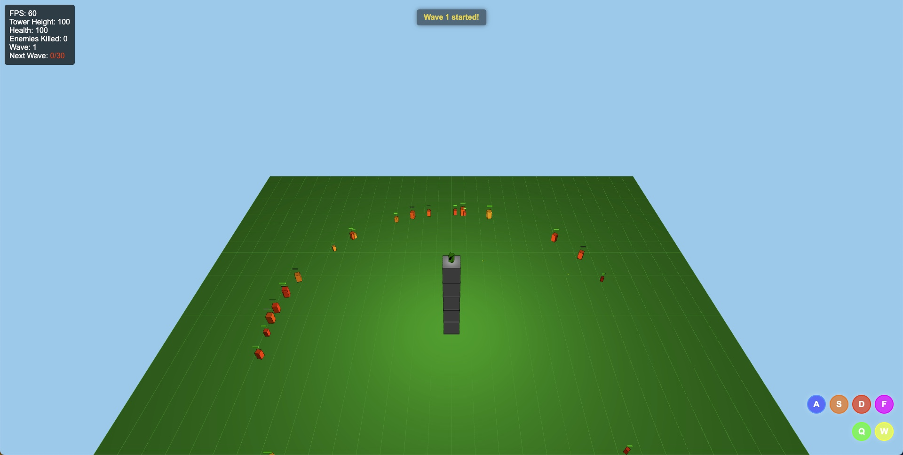
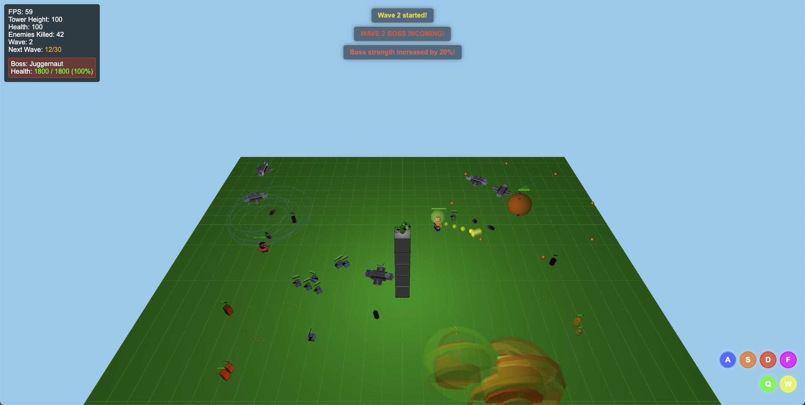
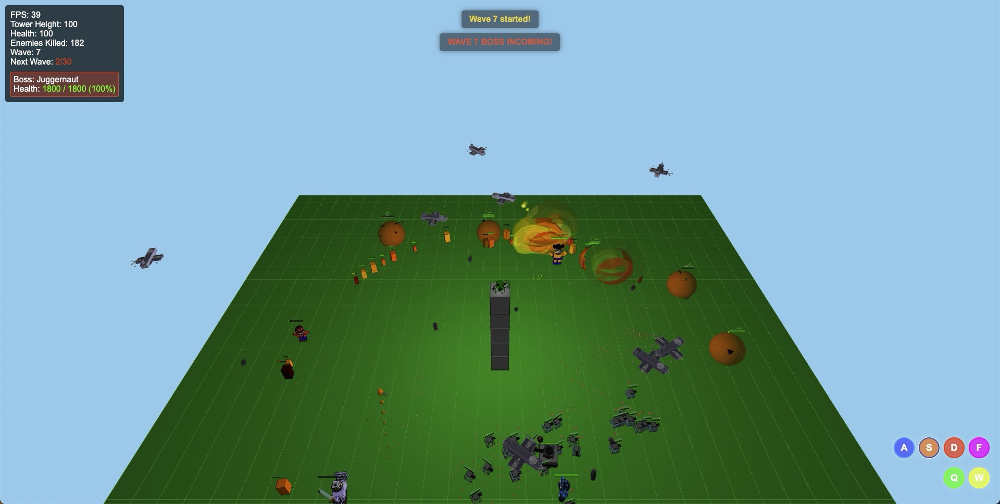
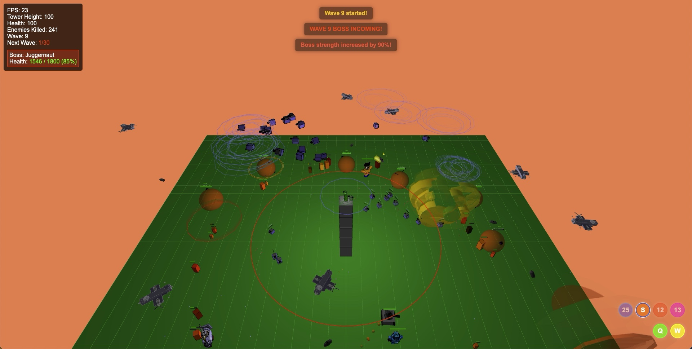

# Bul Soldier

A dynamic browser-based game built with p5.js where you control a soldier with various special abilities to fight against enemies.


## 🎮 Game Overview

Bul Soldier is an action-packed game where players control a soldier character with access to multiple special skills and abilities. Fight against waves of enemies, upgrade your character, and survive as long as possible.






## ✨ Features

- **Multiple Special Skills**: Use a variety of skills including:
  - Clone: Creates a clone that fights alongside you
  - Turret: Deploys an auto-targeting turret
  - Airstrike: Calls in an airstrike that bombs enemies
  - Laser: Fires a powerful laser beam
  - Game Boy Advanced: Summons random game characters
  - Gas Lighter: Casts random fire skills

- **Progressive Difficulty**: Face increasingly challenging waves of enemies
- **Upgrade System**: Improve your character's abilities as you progress
- **Combo System**: Chain attacks for increased rewards
- **Responsive Design**: Play on desktop or mobile devices
- **Performance Optimized**: Smooth gameplay with performance monitoring

## 🎯 Controls

### Keyboard Controls
- WASD: Movement
- Mouse: Aim and shoot
- Skill Keys:
  - A: Clone
  - S: Turret
  - D: Airstrike
  - F: Laser
  - Q: Game Boy Advanced
  - W: Gas Lighter

### Touch Controls
- Virtual joystick for movement
- Touch buttons for skills
- Auto-aim system for mobile play

## 🚀 Installation

1. Clone the repository:
```
git clone https://github.com/yourusername/p5js-soldier.git
```

2. Open the project folder:
```
cd p5js-soldier
```

3. Serve the files using a local web server. For example, with Python:
```
# Python 3
python -m http.server

# Python 2
python -m SimpleHTTPServer
```

4. Open your browser and navigate to `http://localhost:8000`

## 🔧 Development

The game is built with a modular architecture:

- `core/`: Main game logic and systems
  - `controls/`: Input handling systems
  - `entities/`: Game objects (player, enemies, projectiles)
  - `managers/`: System managers (collision, particles, sound)
  - `ui/`: User interface components
- `config/`: Game configuration files
- `sounds/`: Audio assets
- `fonts/`: Typography assets

## 📱 Progressive Web App

Bul Soldier is also available as a Progressive Web App (PWA), allowing you to install it on your device and play offline.

## 🛠️ Technologies Used

- [p5.js](https://p5js.org/) - Creative coding library
- [p5.sound](https://p5js.org/reference/#/libraries/p5.sound) - Sound library for p5.js
- HTML5 Canvas with WebGL rendering
- JavaScript ES6 Modules

## 📄 License

This project is licensed under the MIT License - see the LICENSE file for details.

## 🙏 Acknowledgements

- p5.js community for the amazing creative coding library
- All contributors and testers who helped improve the game